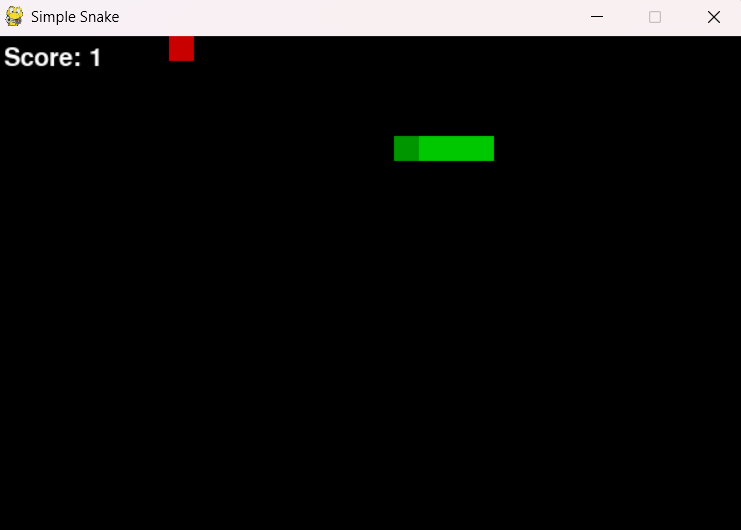

# Simple Snake (Python + Pygame)

A minimal Snake game implemented in Python using `pygame`.



**Requirements**
- Python 3.8+
- `pip` (or `python -m pip`)

**Install dependencies (PowerShell)**

```powershell
python -m pip install -r requirements.txt
```

**Run the game**

```powershell
python main.py
```

**Controls**
- Arrow keys or `WASD` to move
- Press `R` to restart after game over
- Close the window to quit

**Files**
- `main.py`: game source
- `requirements.txt`: Python dependencies

If you'd like features (wall wrap, levels, sound, high scores, mobile support), tell me which and I can add them.