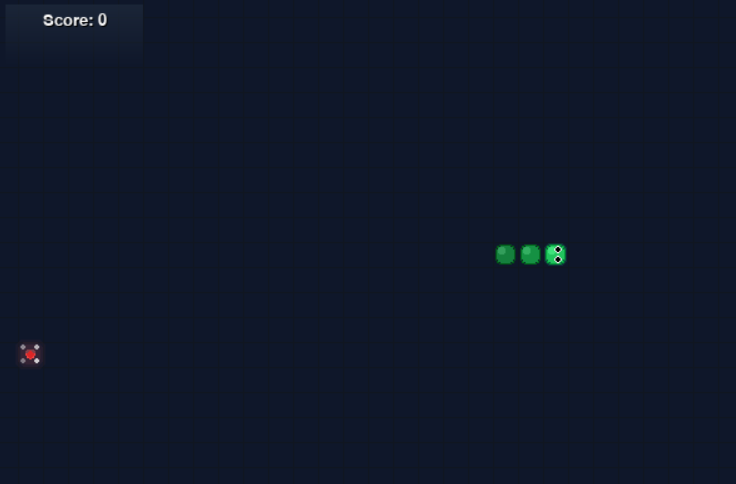

# Snake Game (Python + Pygame)

An enhanced Snake game with advanced graphics, power-ups, special foods, and smooth animations implemented in Python using `pygame`.

## Screenshots

**Old Version:**


**Latest Version:**


**Requirements**
- Python 3.8+
- `pip` (or `python -m pip`)

**Install dependencies (PowerShell)**

```powershell
python -m pip install -r requirements.txt
```

**Run the game**

```powershell
python main.py
```

**Controls**
- Arrow keys or `WASD` to move
- Press `R` to restart after game over
- Press `ESC` to quit
- Close the window to quit

**Features**
- 🎨 Enhanced graphics with smooth animations and particle effects
- ⭐ Special food types (Normal, Bonus 3x, Special 5x points)
- ⚡ Power-ups (Speed Boost, Slow Motion, Double Points, Invincibility)
- 📈 Progressive difficulty (speed increases with score)
- 🎯 Score multipliers and strategic gameplay
- 👀 Snake with directional eyes and gradient effects

**Files**
- `main.py`: game source
- `requirements.txt`: Python dependencies
- `Demo.png`: original version screenshot
- `Demo-v2.png`: enhanced version screenshot